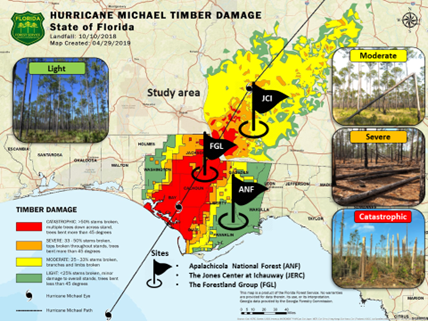
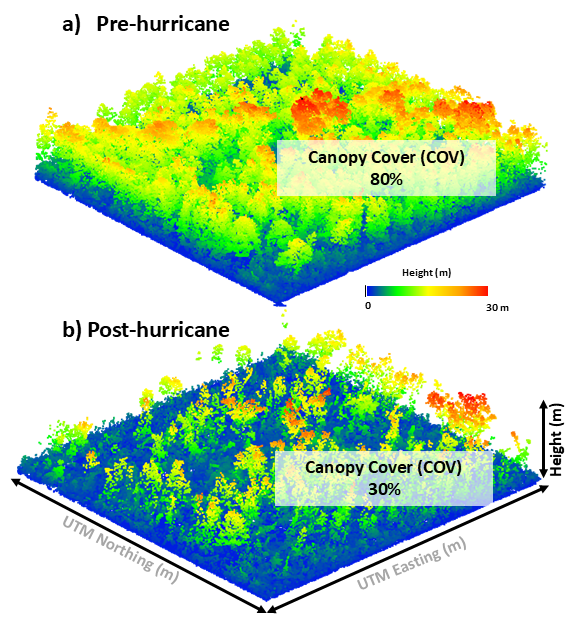

## Current Projects

### **RRCVirtualForest**

Beginning summer 2026, we will be collecting field and remote sensing data at the Rice Rivers Center in order to build a digital twin of the forest ecosystem as a teaching and research tool. More to come!

### [**ICESat-4D: Monitoring Forest Resistance and Post-Hurricane Recovery Dynamics in Southern Forests by the Synergism of ICESat-2, SAR, and Optical Data and an Ecosystem Demography Model**](https://carlos-alberto-silva.github.io/silvalab/icesat4d/icesat4d_home.html)

ICESat4D is a research project funded by NASA's ICESat2 program and led by PI Carlos Silva at the Forest Biometrics, Remote Sensing, and AI Lab (SilvaLab) at the University of Florida in partnership with the USDA Forest Service, Jones Center at Ichauway & VCU. This project aims to understand the impact of hurricane disturbance on forest structure and AGBD resistance and recovery using ICESat-2 data combined with passive optical and SAR data, advanced statistical modeling methods, and a process-based Ecosystem Demography Model (EDv2.2) in southern forests in Florida and Georgia.

::: {layout-ncol="2"}

:::

At left, the study area (36,218.00 km2) of the proposed work highlighted by the Florida Forest Service estimates of timber damage severity from Hurricane Michael. Study sites for data collection: Apalachicola National Forest (ANF) and the Forestland Group (FGL) forests in FL, and the Jones Ecological Research Center (JERC) at Ichauway in GA. At right, ALS Pre- and post-hurricane Michael derived canopy cover estimates.

## Collaborations

### [**CMS4D: A Multi-Scale Data Fusion Prototype System for the next Generation of Carbon Dynamics Monitoring from Space: A Case Study in the Brazilian Cerrado -- Fire and Fuel in a Biodiversity Hotspot**](https://carlos-alberto-silva.github.io/silvalab/cms4d/cms4d_home.html)

CMS4D is a research project funded by [NASA's Carbon Monitoring System](https://carbon.nasa.gov/legacy.html) program and led by PI Carlos Silva at the Forest Biometrics, Remote Sensing, and AI Lab [(SilvaLab)](https://carlos-alberto-silva.github.io/silvalab/lab.html) at the University of Florida. It started in August 2023 and is scheduled to last for a duration of 3 years. CMS4D is built upon pioneering work led by [Dr. Carine Klauberg ](https://www.researchgate.net/profile/Carine-Klauberg-2/2)in the Brazilian Cerrado during 2019-2021 through a project funded by the [National Council for Scientific and Technological Development (CNPq)](https://www.gov.br/cnpq/pt-br) - PrevFogo program.

## Past Projects & Collaborations
